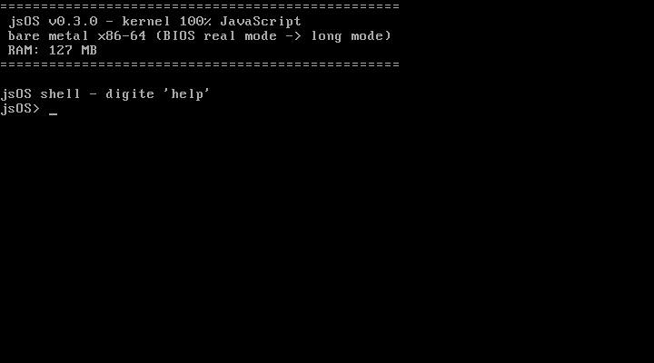

# windows-10-js (jsOS)

**Kernel bare metal escrito em JavaScript**, com arquitetura inspirada no
Windows NT — boota de verdade (BIOS → real mode → protected mode → long mode
64-bit) e executa até `.exe` Windows (PE32+) nativamente, com o loader e o
mini-kernel32 em JS.



## Por que existe um pouco de C e Assembly?

A CPU x86-64 só executa código de máquina — não existe boot "100% JS" no
hardware. Então existe uma **camada hospedeira fixa, escrita uma vez**, e o
sistema operacional de verdade (tudo que você edita e evolui) é JavaScript:

| Camada | Linguagem | O que faz |
|---|---|---|
| Boot (real mode → long mode) | Assembly | setor de boot, E820, A20, GDT, carga do kernel via ATA PIO, paginação, SSE |
| Trampolins de hardware | Assembly | vetores de IRQ (irqstubs.asm), ABI MS→SysV (win32thunk.asm) |
| Motor + primitivas | C | engine **QuickJS** + `os.*` de uma instrução (portas, memória física, lidt, msr, cpuid, heap, bundle) |
| **Sistema operacional** | **JavaScript** | nanokernel (IRQ/IPC/serviços), Object Manager, I/O Manager (IRPs), drivers, VFS, NTFS, syscalls, escalonador, shell, loader PE, mini-kernel32 |

É a mesma relação que o Node.js (C++) tem com o seu código JS — só que aqui o
C++ não tem sistema operacional embaixo: é bare metal. Detalhes em
[docs/ARCHITECTURE.md](docs/ARCHITECTURE.md).

## Estrutura

Espelha a arvore-fonte do Windows NT (WRK): `boot/`, `hal/`, `system32/`
com `ntos/{ob,mm,ps,ex,fs,rtl,test}`, `drivers/`, `win32/`.

```
├── boot/                     # Assembly: boot.asm (setor 512B) + stage2.asm
│                             #   (real→prot→long mode, E820, ATA PIO, paging)
├── hal/                      # HAL + engine host (camada C fixa, minima)
│   ├── core/                 #   kernel_main.c, host.c/h, drivers.h, link.ld,
│   │                         #   irqstubs.asm (trampolins de IRQ)
│   ├── mm/                   #   kmalloc.c (heap K&R; inicio 16MB)
│   ├── rtc/                  #   rtc.c (relogio CMOS p/ Date do engine)
│   ├── qjs/                  #   engine.c + jsos.h + primitives_{ports,memory,
│   │                         #   system,irq}.c (contexto QuickJS + os.*)
│   ├── win32/                #   win32thunk.asm (ABI MS x64 → SysV → JS)
│   └── rtl/                  #   libc shim minimo (exigido pelo engine)
├── system32/                 # ★ O SISTEMA — 100% JavaScript ★
│   ├── main.js               #   entry: raiz de composicao (monta o SO)
│   ├── nano/                 #   NANOKERNEL: o mínimo
│   │   ├── irq.js            #     interrupções (IDT construída em JS!)
│   │   ├── ipc.js            #     canais de mensagens entre serviços
│   │   └── kernel.js         #     registro/chamada de serviços
│   ├── ntos/                 #   subsistemas NT (≈ ntoskrnl.exe)
│   │   ├── ob/objmgr.js      #     Object Manager (namespace, handles)
│   │   ├── io/iomgr.js       #     I/O Manager (DriverObject + IRPs)
│   │   ├── mm/memory-map.js  #     MM: mapa de memoria (única fonte)
│   │   ├── mm/pfn.js         #       alocador de frames físicos (PFN)
│   │   ├── mm/paging.js      #       edição real das tabelas de página
│   │   ├── mm/virtual-memory.js#     VirtualAlloc/Free (VA->frame real)
│   │   ├── mm/memory.js      #       visão heap/RAM
│   │   ├── ps/scheduler.js   #     Process Manager (escalonador)
│   │   ├── ex/syscalls.js    #     Executive: tabela de syscalls
│   │   ├── fs/vfs.js         #     VFS (FS em memória)
│   │   ├── fs/ntfs.js        #     NTFS real (leitura: MFT, runlists)
│   │   ├── rtl/module.js     #     runtime: mini CommonJS require()
│   │   └── test/selftest.js  #     autoteste (marca SELFTEST_OK)
│   ├── drivers/              #   drivers JS com DriverEntry (estilo NT)
│   │   ├── video/vga.js      #     VGA 80x25 (writePhysical16 em 0xB8000)
│   │   ├── input/keyboard.js #     teclado PS/2 (IRQ1/polling)
│   │   ├── console/console.js#     console (VGA + serial)
│   │   └── storage/atapio.js #     disco ATA PIO (portas 0x1F0-0x1F7)
│   ├── win32/                #   subsistema Win32
│   │   ├── pe.js             #     loader PE32+ (parse, seções, IAT)
│   │   └── win32.js          #     mini-kernel32 (GetStdHandle, WriteFile...)
│   └── shell/shell.js        #   o "cmd.exe" do jsOS
├── apps/                     # programas do VFS (≈ Program Files)
│   └── win/hello.c           #   fonte do hello.exe (demo .exe Windows)
├── vendor/                   # quickjs (engine) + musl-math (libm, MIT)
├── tools/                    # build.mjs, test-boot.mjs, run.bat, zig/
├── docs/                     # screenshots
├── build/                    # TUDO gerado (kernel.elf, os.img, hello.exe)
└── README.md
```

## Primitivas `os.*` (a única porta do JS para o hardware)

Nomes sem abreviação, divididos por área no C (`hal/qjs/primitives_*.c`):

| Função | Descrição |
|---|---|
| `os.debugPrint(...)` | serial COM1 com newline (debug do kernel) |
| `os.serialWrite(s)` | serial crua, sem newline |
| `os.writePort8(p, v)` / `os.readPort8(p)` / `os.readPort16(p)` | I/O de porta |
| `os.writePhysical8/16/32(addr, v)` / `os.readPhysical8/16/32(addr)` | memória física |
| `os.readBundleText(nome)` / `os.readBundleBytes(nome)` | arquivo do bundle (texto / ArrayBuffer) |
| `os.listBundleFiles()` | nomes dos arquivos embutidos |
| `os.execMachineCode(addr)` | chama código nativo x86-64 (entry de PE) |
| `os.getWin32ThunkTable()` | base da tabela de trampolins Win32 |
| `os.loadIdt(addr, size)` | carrega a IDT (lidt + sti) |
| `os.getIrqStubTable()` | base dos trampolins de IRQ (asm fixo) |
| `os.readMsr(n)` / `os.writeMsr(n, v)` / `os.cpuid(leaf)` | MSRs e CPUID |
| `os.getRamSize()` / `os.getHeapInfo()` | RAM (E820) / uso do heap |
| `os.halt()` | desliga |

## Arquitetura estilo Windows NT (em construção)

O jsOS espelha a arquitetura do Windows NT, com cada camada em JS:

| Windows NT | jsOS | Módulo |
|---|---|---|
| HAL | primitivas de hardware | `hal/` C + `system32/drivers/` |
| boot fases 0/1 | phase0 + phase1 (init em fases estilo NT) | `system32/init/` ✅ |
| tabela de serviços | syscalls numeradas | `system32/ntos/ex/syscalls.js` |
| **Object Manager** | namespace único, handles, refcount | `system32/ntos/ob/object-manager.js` ✅ |
| Process Manager | escalonador cooperativo + threads de kernel (PsCreateSystemThread) | `system32/ntos/ps/` ✅ |
| **Memory Manager** | PFN (frames físicos reais) + split 2MB→4KB + map/unmap de PTEs em JS + VirtualAlloc/Free | `system32/ntos/mm/` ✅ |
| DPCs / IRQL / spinlocks | `ke/irql.js` + `ke/dpc.js` (DPCs a DISPATCH_LEVEL) | ✅ |
| I/O Manager (IRP) | IRPs + drivers JS/nativos | `system32/ntos/io/io-manager.js` ✅ |
| PnP Manager | IRP_MJ_PNP / START_DEVICE | io-manager ✅ |
| Config Manager (Registry) | hive em JS + Zw* para drivers | `system32/ntos/cm/` ✅ |
| Services (carga por Registry) | drivers .sys lidos de \System\Services | `system32/ntos/cm/services.js` ✅ |
| subsistema Win32 | mini-kernel32 + loader PE | `system32/win32/` |

O Object Manager (`ob/objmgr.js`) é a fundação NT: **tudo é objeto** —
diretórios, arquivos, dispositivos, links simbólicos — num namespace único
case-insensitive, aberto por handle com contagem de referência:

```
\                               [Directory]
├── \FS  (mount → VFS)          [Directory, mount]  ← \FS\README vira File
├── \Device                     [Directory]
│   ├── \Device\Console         [Device]
│   └── \Device\Keyboard        [Device]
└── \DosDevices                 [Directory]
    └── \DosDevices\C:          [SymbolicLink → \FS]   ← como no NT de verdade
```

Syscalls novas: `open`=11, `close`=12. No shell, `objects` mostra a árvore e
caminhos `C:\arquivo` funcionam (o shell traduz para o VFS; o namespace NT
resolve `\DosDevices\C:\...` seguindo o link).

Roadmap NT: Fase A ✅ Object Manager → Fase B ✅ **I/O Manager**
(`ntos/io/iomgr.js`: DriverObject/DeviceObject + IRPs; drivers registram com
`DriverEntry` na inicialização) → Fase C: processos como objetos com handles →
Fase D: Registry-like em JS → Fase E: camada user-mode (ntdll-like).

## NTFS (leitura real)

`ntos/fs/ntfs.js` implementa NTFS de verdade (somente leitura): boot sector,
MFT com fixup (USA), atributos residentes e não-residentes (runlists com
deltas sinalizados), `$FILE_NAME` e diretórios via `$INDEX_ROOT`. O driver de
disco é `drivers/storage/atapio.js` (ATA PIO por portas, 100% JS). No boot, o
disco slave IDE é montado em `D:` (via `\DosDevices\D:` → `\NTFS`).
`tools/mkntfs.py` gera a imagem de teste (`build/ntfs.img`, com HELLO.TXT).

Escrita/journal/ACLs ficam para depois — NTFS completo é um projeto do tamanho
do ntfs-3g; aqui a fundação é real e testada.

## Sistema de módulos em JS

Todo subsistema é um **módulo CommonJS exportável** — `ntos/rtl/module.js`
implementa `require()` lendo do bundle embutido (raiz: `system32/`). Você monta
e estende o sistema em `system32/main.js` só com JavaScript:

```js
const require = JSOS.require;
const VFS       = require('ntos/fs/vfs');
const Scheduler = require('ntos/ps/scheduler');
const VGA       = require('drivers/video/vga');
// seu modulo novo: system32/ntos/ex/meu_modulo.js com module.exports = {...}
```

Nada de globals soltos: cada arquivo tem `module.exports` e declara suas
dependências com `require('...')`.

## Compatibilidade com Windows (.exe)

O jsOS **executa .exe Windows (PE32+, console, x86-64) nativamente**, com o
loader e a API em JavaScript:

- `system32/win32/pe.js` — faz o parse do PE, mapeia seções na memória física
  no ImageBase preferido (`0x400000`) e resolve a IAT (imports por nome de
  `KERNEL32.dll`) apontando para os trampolins de `hal/win32/win32thunk.asm`.
- `hal/win32/win32thunk.asm` — converte a ABI Microsoft x64 → SysV e despacha.
- `hal/qjs/engine.c: js_win32_dispatch` — chama o handler JS.
- `system32/win32/win32.js` — as APIs Windows em si (hoje: `GetStdHandle`,
  `WriteFile`, `ExitProcess`, `GetTickCount`), implementadas sobre syscalls do jsOS.

Demo: `exec /hello.exe` no shell (ou rode o autoteste) — um `.exe` compilado
para Windows roda no metal e imprime via "kernel32" em JS. Fonte em
`apps/win/hello.c`, compilado no build com `zig cc -target x86_64-windows-gnu`.

**Limites honestos**: para rodar programas Windows maiores (CRT do mingw/msvc,
GUI, threads, DLLs) seria preciso implementar centenas de APIs e o formato de
exceções SEH — é o escopo do ReactOS (décadas de trabalho). O caminho é
expandir `win32.js` API a API.

## Drivers `.sys` estilo Windows (WDM de brinquedo, real de verdade)

O jsOS **carrega e executa drivers no formato `.sys` do Windows** (PE nativo,
`DriverEntry`, dispatch de IRPs) — com o modelo de kernel em JavaScript:

- `system32/win32/pe-loader.js` — o mesmo loader PE; resolve imports de
  `ntoskrnl.exe` contra a tabela em `system32/win32/ntoskrnl.js` (ids 32-63 do
  trampolim; o C roteia `id>=32` para `globalThis.Ntoskrnl.handle`).
- `system32/win32/ntoskrnl.js` — os exports do kernel em JS: `DbgPrint`,
  `IoCreateDevice`, `IoCreateSymbolicLink`, `IoDeleteDevice`, `IoAllocateIrp`,
  `IoFreeIrp`, `IoCompleteRequest`, `RtlInitUnicodeString`,
  `RtlCompare/Copy/EqualUnicodeString`, `KeQuerySystemTime`, `KeQueryTickCount`,
  `MmAllocate/FreeNonCachedMemory`, `ExAllocatePoolWithTag`, `ExFreePool` —
  com **alocador real de heap do convidado** (lista livre com split+coalesce;
  free reusa endereços, verificado em teste).
- `system32/ntos/io/io-manager.js` — despacha IRPs para drivers JS **ou
  nativos** (serializa o IRP para a memória do convidado e chama a rotina de
  dispatch do driver com `os.execMsAbi`).

Drivers demo em `apps/drivers/*.c` (cada um vira `*.sys` no build, compilado
com `zig cc` no Windows — a import library `ntoskrnl.lib` é gerada da própria
tabela JS via `zig dlltool`, fonte única de verdade). Todos cobertos pelo
autoteste: echo.sys, irplife.sys, rtlstr.sys, ketime.sys, mmmem.sys,
expool.sys. No shell: `loaddriver /echo.sys`.

**Limites honestos**: nossa ABI de structs é um subconjunto documentado estilo
NT — drivers WDM de terceiros (com centenas de exports e semântica exata)
continuam fora de alcance; o caminho é expandir a tabela export a export.

## E drivers .sys do Windows?

**Não é viável** — drivers WDM dependem do ntoskrnl, HAL, I/O Manager, PnP,
Registry e dezenas de subsistemas com semântica exata do Windows NT; é a parte
mais difícil do ReactOS. O jsOS tem seu próprio modelo de drivers **em
JavaScript** (`system32/drivers/video/vga.js`, `input/keyboard.js` são drivers
de verdade, falando com hardware via `os.inb/outb/poke`), que é o caminho
sustentável para este projeto crescer.

## Build e execução

Pré-requisitos: NASM, Node.js, Python (para conversões), QEMU em
`C:\Program Files\qemu`. O Zig é baixado automaticamente em `tools/zig` pelo
build (única dependência de toolchain, portátil).

```bat
node tools\build.mjs        :: compila tudo e gera build\os.img
tools\run.bat               :: boot interativo (janela VGA, aceleração WHPX)
node tools\test-boot.mjs    :: boot headless; PASS se SELFTEST_OK no serial
```

O teste headless sobe a VM, o kernel JS roda o autoteste (VFS, syscalls,
execução de programa do VFS, escalonador) e imprime `SELFTEST_OK` na serial.

## Como o kernel JS funciona

- `js/main.js` é embutido no kernel pelo build (bundle `src/generated/jsbundle.c`)
  e executado após o boot. Para editar o sistema: mexa em `js/`, rode
  `node tools\build.mjs` de novo.
- **Processos** são funções geradoras (`function*`) cooperativas: cada `yield`
  devolve a CPU ao escalonador. O shell é o processo 1. `spawn /pisca.js` no
  shell cria um segundo processo; `ps` lista; `kill <pid>` mata.
- **Syscalls numeradas** (`SYS(num, ...)`): print=0, read=1, write=2, list=3,
  remove=4, exists=5, meminfo=6, getchar=7, clear=8, halt=9, ramsize=10.
  Programas JS do VFS (`run /hello.js`) recebem `SYS` como argumento — nunca
  tocam `os.*` direto.
- **VFS** em memória com namespace plano (`/README`, `/hello.js`, ...).

## Marcadores de boot (serial COM1)

`B E A P K G L 6` = stage2 progredindo (real→prot→ATA→paginação→long mode);
`HELLO_KERNEL_OK` = host C vivo; `KERNEL_JS_OK` = main.js executando;
`SELFTEST_OK` = autoteste passou.

## Roadmap (próximos passos possíveis)

- IDT própria + IRQ1 de teclado (hoje o teclado é polling 100% JS)
- Persistência: driver ATA PIO em JS + FS simples em setores do disco
- Timer IRQ0 → escalonador preemptivo (troca de contexto real)
- Modo gráfico (VBE/framebuffer) e desktop em JS
